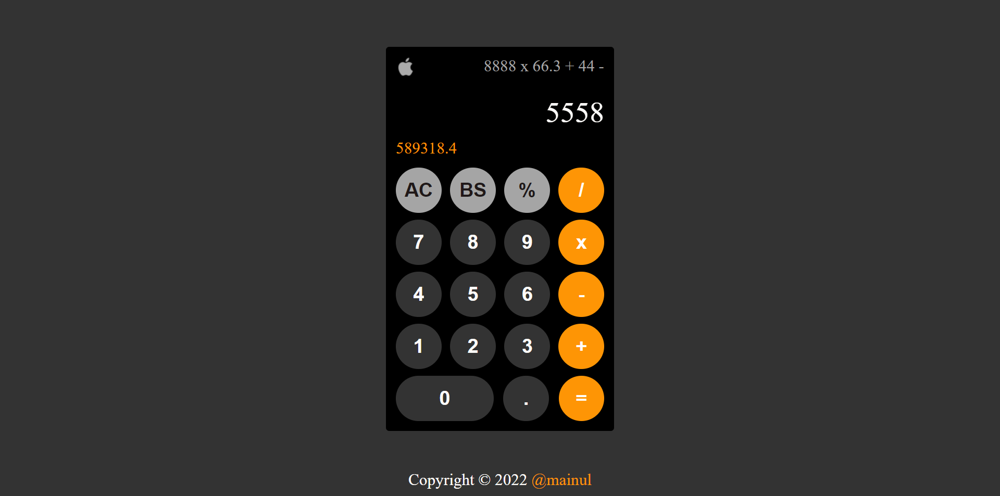

# calculator
 On-screen calculator project from The Odin Project using JavaScript, HTML, and CSS.

Solution for the [PROJECT: CALCULATOR](https://www.theodinproject.com/paths/foundations/courses/foundations/lessons/calculator) from the [Foundations](https://www.theodinproject.com/paths/foundations/courses/foundations) part of [The Odin Project](https://www.theodinproject.com/).

## Table of contents
- [Overview](#overview)
  - [Requirement](#project-requirement)
  - [Solution Screenshot](#solution-screenshot)
  - [Links](#links)
- [My process](#my-process)
  - [Built with](#built-with)
  - [What I learned](#what-i-learned)
- [Author](#author)

### Project-Requirement
1. The calculator should contain some basic functions for all of the basic math operators.
2. Users should be able to string together several operations and get the right answer.
3. The calculator should not evaluate more than a single pair of numbers at a time.
4. Pressing = before entering all of the numbers or an operator could cause problems!
5. Pressing “clear” should wipe out any existing data.
6. Display a snarky error message if the user tries to divide by 0.
7. EXTRA CREDIT: Users can get floating point numbers if they do the math using decimal and user should be able to input decimal point.
8. EXTRA CREDIT: User Interface should look nice!
9. EXTRA CREDIT: Add a “backspace” button, so the user can undo if they click the wrong number.
10. EXTRA CREDIT: Add keyboard support!

### Solution Screenshot
The final output:

### Links
Live Site URL: [Live site of the challenge hosted here](https://mainul-islam-nirob.github.io/calculator/)

## My process
Hello, this is my 5th project here in The Odin Project. It's a basic calculator. I've tried to make it look similar to apple calculator

### Built with
- HTML5 markup
- CSS
- Grid
- FlexBox
- Javascript
- DOM

### What I learned
- How to think logically

## Author
- Website - Well I haven't made my profile portfolio yet, gonna make it sooon when I know a lot of stuffs
- LinkedIn - [@mainul islam](https://www.linkedin.com/in/mainul-islam-nirob/)
- Frontend Mentor - [@mainul](https://www.frontendmentor.io/profile/Mainul-Islam-Nirob)
- Twitter - [@mainul](https://twitter.com/Mainuli96601040)
- FreeCodeCamp - [@mainul](https://www.freecodecamp.org/mainul)
